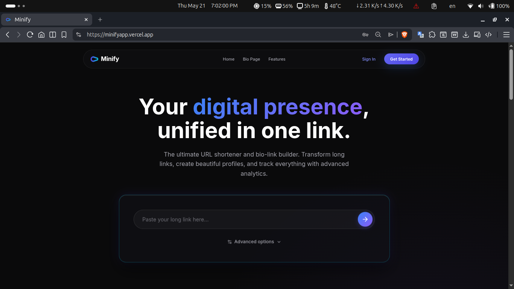
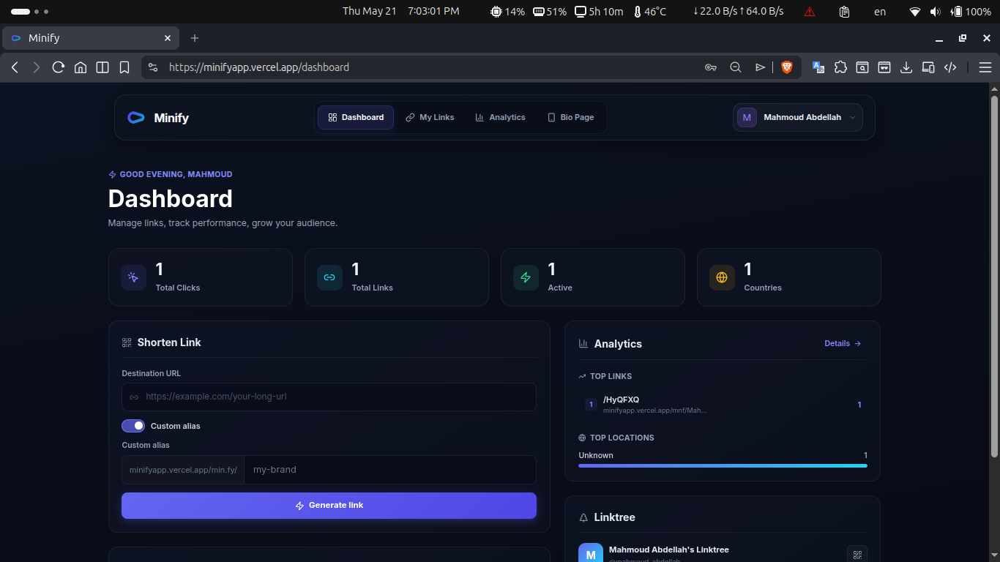
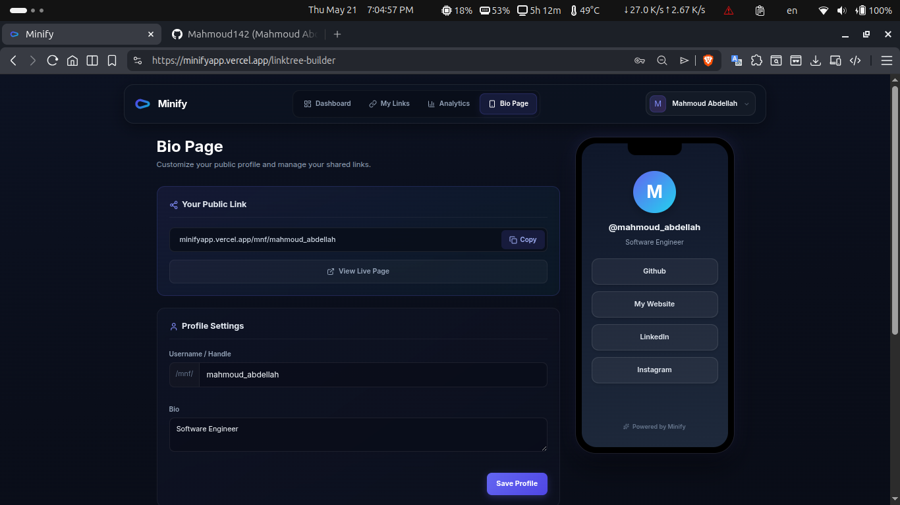
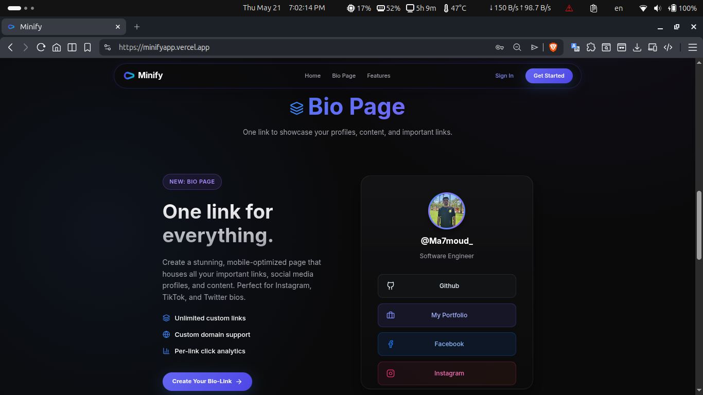
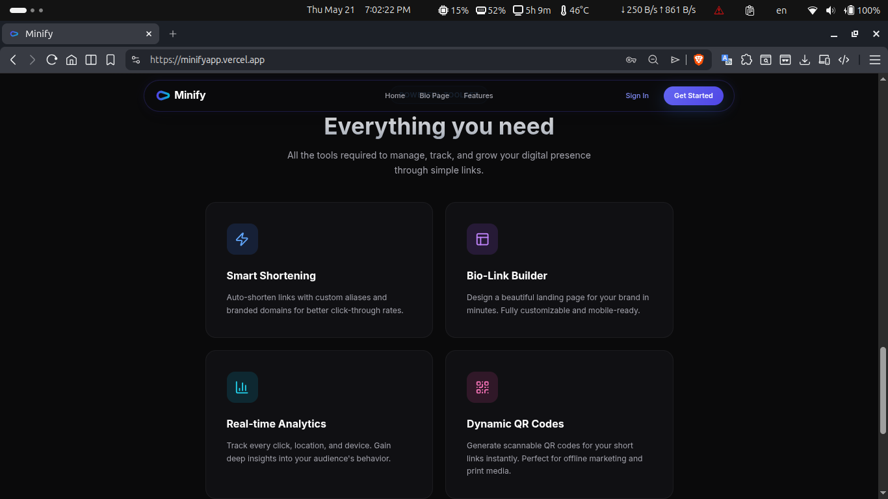
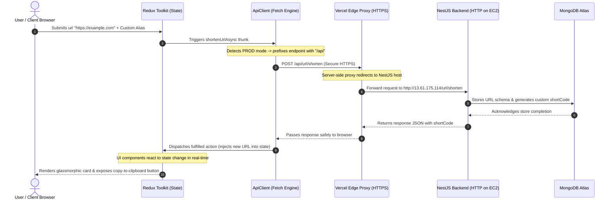
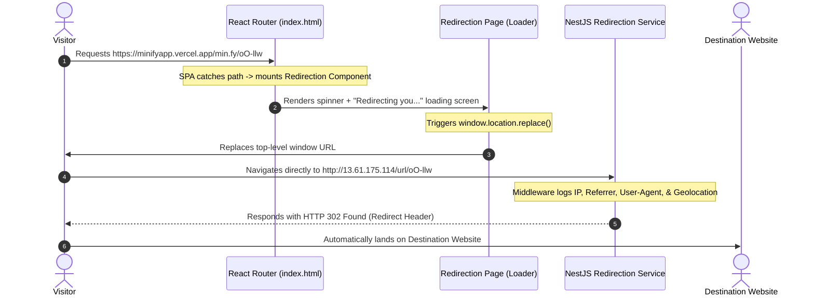

# 🌟 Minify - High-Performance URL Shortener & Linktree Builder

A clean, glassmorphic Single Page Application (SPA) and customizable Linktree builder built with **React 19**, **TypeScript**, and **Redux Toolkit**. Designed with an intermediate redirection page, interactive QR generation, and clean visitor analytics.

🔗 **Production Live Site:** [minifyapp.vercel.app](https://minifyapp.vercel.app/)  
🔗 **API Backend Codebase:** [github.com/Mahmoud142/minify-api](https://github.com/Mahmoud142/minify-api) (NestJS + MongoDB on AWS EC2)

---

## 📸 Application Showcase

### 1. Landing Interface
*Clean glassmorphic entry gate. Anonymous visitors can shorten links instantly, while logged-in users bypass this view via Redux Auth guards.*



---

### 2. URL Shortener Dashboard
*Full link lifecycle management dashboard: custom aliases, instant QR code rendering, and live click tracking.*



---

### 3. Customizable Bio-Link Builder (Linktree)
*Interactive custom builder for creating real-time editable "link-in-bio" profile trees with theme settings and social buttons.*



---

### 4. Published Profile Gate
*High-performance published visitor view containing responsive social icons, brand redirections, and unified profile links.*



---

### 5. Audience Analytics
*Visual data graphs tracking user clicks, operating systems, and browser statistics.*



---

## ⚙️ How It Works (Technical Highlights)

Here are the key technical challenges solved in this project:

### 1. Vercel Reverse Proxy (Bypassing Browser Mixed Content Blocks)
**The Problem:** Browsers strictly block secure HTTPS sites (`https://minifyapp.vercel.app`) from calling insecure HTTP APIs (`http://13.61.175.114/url/shorten`) due to Mixed Content restrictions.  
**The Solution:** Instead of paying for a custom domain SSL on AWS immediately, I configured a reverse proxy in `vercel.json`. This securely routes all `/api/*` traffic to the backend under the hood, completely bypassing the browser block:
```json
{
  "rewrites": [
    {
      "source": "/api/:path*",
      "destination": "http://13.61.175.114/:path*"
    },
    {
      "source": "/((?!api/).*)",
      "destination": "/index.html"
    }
  ]
}
```

### 2. Dynamic API Base Client
To make local development seamless while supporting production deployments, the API client automatically resolves the target URL based on the environment:
```typescript
const isProd = import.meta.env.PROD;
const API_BASE_URL = isProd
    ? "/api"
    : (import.meta.env.VITE_API_BASE_URL || "http://13.61.175.114").replace(/\/+$/, "");
```

---

## ⚡ Performance & Security Features

### 1. GPU-Accelerated Animations (60 FPS)
To ensure the glassmorphic dashboards and transitional pages render smoothly on mobile devices, all intensive animations utilize CSS hardware acceleration (`transform: translate3d`) and `will-change` properties. This delegates layout rendering to the GPU and avoids high-cost CPU reflows.

### 2. Clean Redux Toolkit State Management
Uses Redux Toolkit with async thunks to handle non-blocking, asynchronous backend updates. State is updated atomically, ensuring the UI remains highly responsive without volatile re-renders.

### 3. Secure JWT Interceptor & Route Guards
- **Automatic Interceptor:** Outgoing fetch calls automatically read the JWT from LocalStorage and inject it into the `Authorization: Bearer` header.
- **Route Guards:** Uses nested React Router layouts as route guards. It evaluates token verification at the top-level before allowing access to dashboard subroutes.

---

## 🗺️ System Architecture

### 1. 🚀 API & State Management Pipeline



---

### 2. 🔄 Intermediate Redirection Gateway



---

## 🛠 Tech Stack

- **Core Engine:** React 19, TypeScript, Vite (asset bundling, ES modules)
- **State Management:** Redux Toolkit (Thunks, Slices)
- **Styles:** Modular CSS with Glassmorphism
- **Routing:** React Router 7 layouts and guards

---

## 📂 Project Structure

```txt
minify-web/
├── public/
│   └── screenshots/         # Application showcase screenshots
├── src/
│   ├── app/                 # Global Redux store & hooks
│   ├── components/          # Shared components (QrModal, Navbar, etc.)
│   ├── features/            # Feature slices & selectors (Auth, Urls)
│   ├── layouts/             # Layout frames (AuthLayout)
│   ├── lib/                 # Core API Client wrapper
│   ├── pages/
│   │   ├── Redirection.tsx  # Redirection transition resolver
│   │   ├── Home.tsx         # Landing page with Redux Auth guard
│   │   ├── Dashboard.tsx    # Shortener and QR management panel
│   │   └── Analytics.tsx    # Live analytics metrics board
│   └── routes/              # Protected & public routing gates
└── vercel.json              # Edge Proxy & SPA client fallback rules
```
