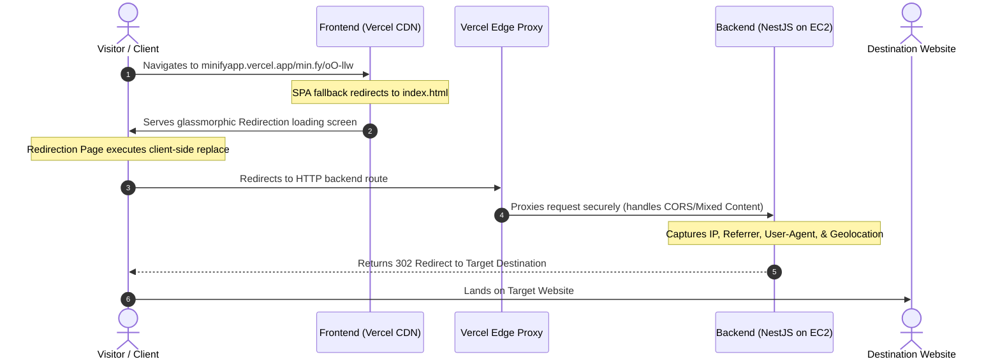

# 🌟 Minify - Premium Architecture & Integration Guide

Welcome to the official **Minify** integration and architecture documentation. This guide details how the frontend and backend services collaborate to deliver a fast, glassmorphic, and trackable URL shortening experience.

---

## 🗺️ System Architecture & Workflow

Below is the complete client-to-server request cycle, illustrating how client-side routing, Vercel edge proxying, and background analytics tracking operate securely:



---

## 📂 Codebase File Structure

Here is how the key integration components are structured inside the repository:

```txt
minify-web/
├── public/                  # Static assets
├── docs/
│   ├── architecture.md      # This guide
│   └── screenshots/         # 📸 Place your screenshots here!
├── src/
│   ├── pages/
│   │   ├── Redirection.tsx  # Local frontend-based redirect engine
│   │   ├── Redirection.css  # Premium glassmorphic redirect UI styling
│   │   └── Home.tsx         # Public landing page with Redux Auth guard
│   ├── lib/
│   │   └── apiClient.ts     # Dynamic API Base Client with environment checks
│   └── App.tsx              # React router configuration
└── vercel.json              # Vercel SPA routing fallback & Reverse Proxy rules
```

---

## 📸 Screenshots Directory & Integration Guide

To make this documentation highly visual and polished, a dedicated screenshot repository has been set up at:
📁 **`docs/screenshots/`**

### How to place and reference your screenshots:
1. Capture screenshots of your running application on the web.
2. Save the files into the `docs/screenshots/` folder.
3. Rename the files according to the sections below.
4. Keep the relative paths intact (e.g., `./screenshots/filename.png`) so GitHub renders them perfectly on your repository homepage.

---

## 🖼️ Application Showcase (Visual Flow)

### 1. Public Landing Page (`Home.tsx`)
*The entry point of Minify, built with a dark glassmorphic design. Visitors can shorten links anonymously, while authenticated users are automatically redirected directly to their custom Dashboard.*

> [!TIP]
> **Recommended Screenshot**: Capture the full hero section with the background glow and the prominent shortening input box.
> **Filename**: `docs/screenshots/landing_page.png`


---

### 2. Premium User Dashboard (`Dashboard.tsx`)
*The central workspace where registered users can generate premium links with custom aliases, track total clicks, and view their recently created links in real-time.*

> [!TIP]
> **Recommended Screenshot**: Capture the main dashboard showing the glassmorphic panel with the *"Generate Link"* form and a few active list rows below it.
> **Filename**: `docs/screenshots/dashboard.png`


---

### 3. QR Code Generator Modal (`QrModal.tsx`)
*Interactive QR generation modal that allows users to instantly download high-quality QR codes linked to their shortened frontend redirection routes.*

> [!TIP]
> **Recommended Screenshot**: Capture the modal popup displaying a generated QR code over the dimmed dashboard background.
> **Filename**: `docs/screenshots/qr_generator.png`


---

### 4. Link Leaderboard & Analytics (`Analytics.tsx`)
*Comprehensive dashboard detailing global performance statistics, audience locations by country, browser distribution, and link health indicators.*

> [!TIP]
> **Recommended Screenshot**: Capture the *"Global Analytics"* panels showing country tracking progress bars and link leaderboard clicks.
> **Filename**: `docs/screenshots/analytics.png`


---

### 5. Frontend Redirection Loader (`Redirection.tsx`)
*The intermediate landing page visitors see for a split-second. The page displays a premium high-performance spinner while preparing the destination transfer.*

> [!TIP]
> **Recommended Screenshot**: Capture the loading page mid-transition showing the *"Redirecting you..."* glassmorphic card.
> **Filename**: `docs/screenshots/redirection_loader.png`


---

## ⚙️ Technical Integration Details

### 1. Mixed Content & Vercel Reverse Proxy
To prevent web browsers from blocking insecure HTTP API requests (`http://13.61.175.114/`) on the HTTPS production frontend (`https://minifyapp.vercel.app`), the `vercel.json` config routes requests through an encrypted server-to-server edge proxy:
```json
{
  "rewrites": [
    {
      "source": "/api/:path*",
      "destination": "http://13.61.175.114/:path*"
    },
    {
      "source": "/((?!api/).*)",
      "destination": "/index.html"
    }
  ]
}
```

### 2. Client-Side API Base Resolution
The API client resolves requests locally during development, but routes them through Vercel's proxy dynamically when deployed in production:
```typescript
const isProd = import.meta.env.PROD;
const API_BASE_URL = isProd
    ? "/api"
    : (import.meta.env.VITE_API_BASE_URL || "http://13.61.175.114").replace(/\/+$/, "");
```
